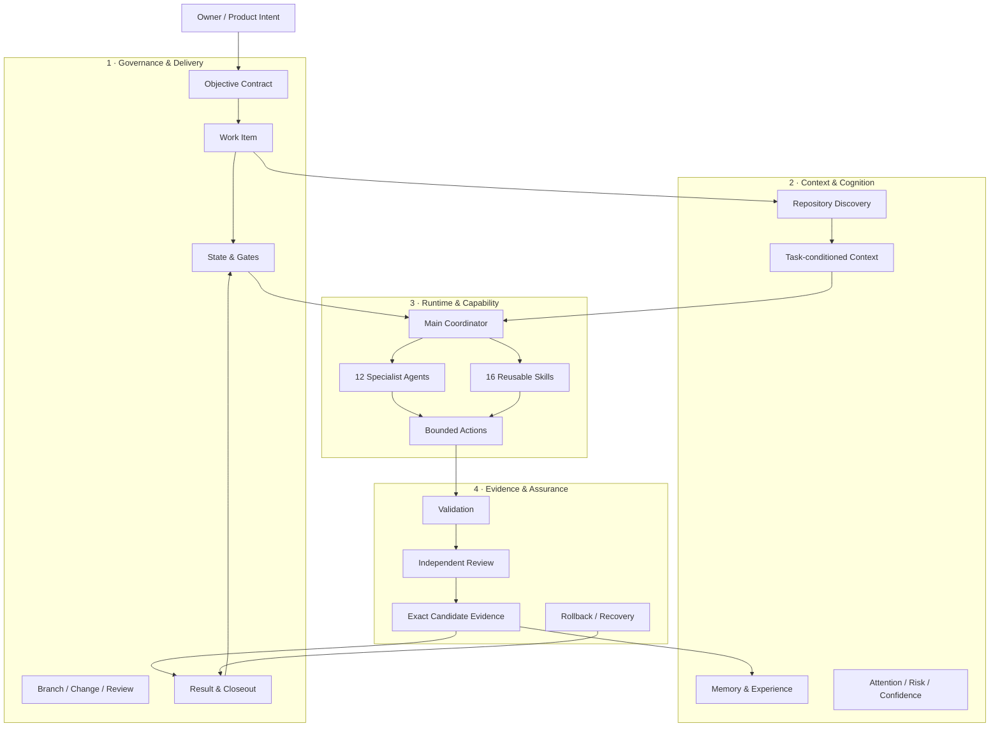
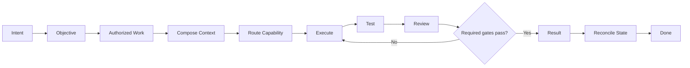
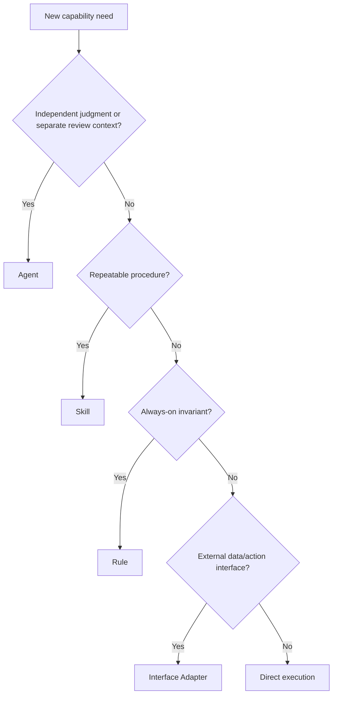

<div align="center">

# SARA

### Agentic Engineering Operating System

**From intent to evidence-backed delivery.**


A model-agnostic, repository-native operating system for governed AI-assisted engineering.

</div>

---

## Why Sara exists

AI can write code quickly. The harder problem is controlling the work around it.

Teams lose time when:

- product intent drifts between conversations and implementation;
- multiple agents overlap or contradict one another;
- the wrong context is loaded into expensive reasoning;
- "done" is claimed without evidence;
- review and release state become inconsistent;
- automation gains more authority than the task requires;
- the human becomes the message bus between every tool and agent.

Sara addresses the operating system around the work.

> **The goal is not more agents. The goal is fewer handoffs, clearer authority, smaller context, stronger evidence, and accepted outcomes.**

---

## What Sara is

Sara unifies four planes:



Each plane has one job. No plane silently becomes the authority for another.

---

## The operating loop



For tiny, low-risk work, Sara deliberately takes the shorter path:

```text
task → direct execution → focused validation → done
```

Ceremony is added only when risk, durability, parallelism, or handoff requires it.

---

## Version 2 at a glance

| Capability | Sara v2 |
|---|---|
| Durable objective and work contracts | Yes |
| Explicit State & Gates | Yes |
| 12 bounded specialist Agents | Yes |
| 16 reusable Skills | Yes |
| Smallest-sufficient routing | Yes |
| Parallel ownership rules | Yes |
| Task-conditioned context contract | Yes |
| Experience & Outcome records | Yes |
| Exact-candidate review evidence | Yes |
| Rollback / recovery discipline | Yes |
| Human gates for protected actions | Yes |
| Vendor or model lock-in | No |
| Mandatory hosted service | No |
| Mandatory database | No |
| Autonomous production authority | No |

---

## Runtime design

Sara does **not** create an agent for every job title.



The Main Coordinator stays thin and invokes only what the task justifies.

### 12 specialist Agents

| Product & Architecture | Engineering | Assurance & Release |
|---|---|---|
| Product Lead | Frontend Engineer | Quality Test Engineer |
| Product Design Lead | Backend & Integration Engineer | Independent Code Reviewer |
| Software Architect | Mobile Application Engineer | Security Architect |
| Workflow Architect |  | Application Security Auditor |
|  |  | Release Engineer |

### 16 reusable Skills

```text
Orchestration & Discovery
├── team-orchestrator
├── repo-discovery
└── delivery-planning

Change & Workflow
├── controlled-change
├── workflow-design
├── workflow-review
├── workflow-validation
└── incident-response

Quality & Evaluation
├── test-evidence
├── test-automation
├── api-testing
└── tool-evaluation

Delivery
├── mobile-application-delivery
├── mobile-store-release
└── app-store-optimization

Communication
└── prompt-engineering
```

---

## Repository structure

```text
sara-agentic-os-public/
│
├── AGENTS.md
├── README.md
├── LICENSE
├── CHANGELOG.md
│
├── sara/
│   └── manifest.json
│
├── runtime/
│   ├── agents/
│   └── skills/
│
├── docs/
│   ├── ARCHITECTURE.md
│   ├── OPERATING_MODEL.md
│   ├── RUNTIME_MODEL.md
│   ├── CONTEXT_ENGINE.md
│   ├── COGNITIVE_ARCHITECTURE.md
│   ├── EVIDENCE_ASSURANCE.md
│   ├── ADOPTION_GUIDE.md
│   └── ROADMAP.md
│
├── templates/
├── examples/
│   └── v2-minimal/
└── scripts/
    └── validate_baseline.py
```

---

## Quick start

1. Copy `PROJECT_CURRENT_STATE.template.md` and `GATES.template.md` into your project state area.
2. Define the real outcome with `OBJECTIVE_CONTRACT.template.yaml`.
3. Bound material work with `WORK_ITEM.template.yaml`.
4. Route only the capabilities the task actually needs.
5. Execute inside explicit ownership.
6. Validate with evidence.
7. Add independent review when material.
8. Close with `EXECUTION_RESULT.template.md` and `OUTCOME.template.yaml`.
9. Reconcile State & Gates.

See [Adoption Guide](docs/ADOPTION_GUIDE.md).

---

## Core rules

### Authority before capability
A model, agent, credential, available tool, or write permission never creates authority by itself.

### Context is evidence, not truth
Retrieved context can support a decision. It cannot silently become product intent, approval, or accepted project state.

### "Done" is a state transition
A task is not complete because an agent says so. Material completion requires the applicable acceptance evidence, exact candidate identity, review state, and human gate.

### Independent review stays independent
The implementer is not the sole final reviewer of a material protected change.

### Parallel work requires isolation
Parallel lanes need explicit ownership. Shared state, migrations, schemas, configuration, and protected state are serialized unless ownership and merge order are defined.

### Recovery exists before risky change
Stateful or hard-to-reverse changes require a rollback or recovery path before authorization.

---

## Protected human gates

Explicit human authorization is required for:

- production release;
- destructive or privileged actions;
- credential or secret changes;
- material data migration;
- security-risk acceptance;
- external financial or communication commitments;
- changes to Sara's own governance or runtime baseline.

---

## Model-agnostic by design

Sara keeps the reasoning engine replaceable.

The durable assets are:

```text
objective
+ project state
+ work contracts
+ agent responsibilities
+ skills
+ evidence
+ outcomes
+ learning history
```

The model is an execution resource, not the source of truth.

---

## Validate the distribution

```bash
python scripts/validate_baseline.py
```

---

## Documentation

| Document | Purpose |
|---|---|
| [Architecture](docs/ARCHITECTURE.md) | Planes, boundaries, control flow |
| [Operating Model](docs/OPERATING_MODEL.md) | End-to-end work lifecycle |
| [Runtime Model](docs/RUNTIME_MODEL.md) | Agent/Skill design and routing |
| [Context Engine](docs/CONTEXT_ENGINE.md) | Context composition and memory boundary |
| [Cognitive Architecture](docs/COGNITIVE_ARCHITECTURE.md) | Experience, outcome and learning model |
| [Evidence & Assurance](docs/EVIDENCE_ASSURANCE.md) | Verification, independent review, rollback |
| [Adoption Guide](docs/ADOPTION_GUIDE.md) | Minimal-to-advanced adoption |
| [Roadmap](docs/ROADMAP.md) | Evidence-driven next stages |

---

## License

Sara Agentic OS is released under the **MIT License**.

Use it, modify it, fork it, ship it, integrate it, and build on it. The MIT copyright and permission notice must be preserved.

See [LICENSE](LICENSE).

---

<div align="center">

### SARA v2.0.0

**Govern the work. Route the right capability. Keep context small. Prove the outcome.**

</div>
