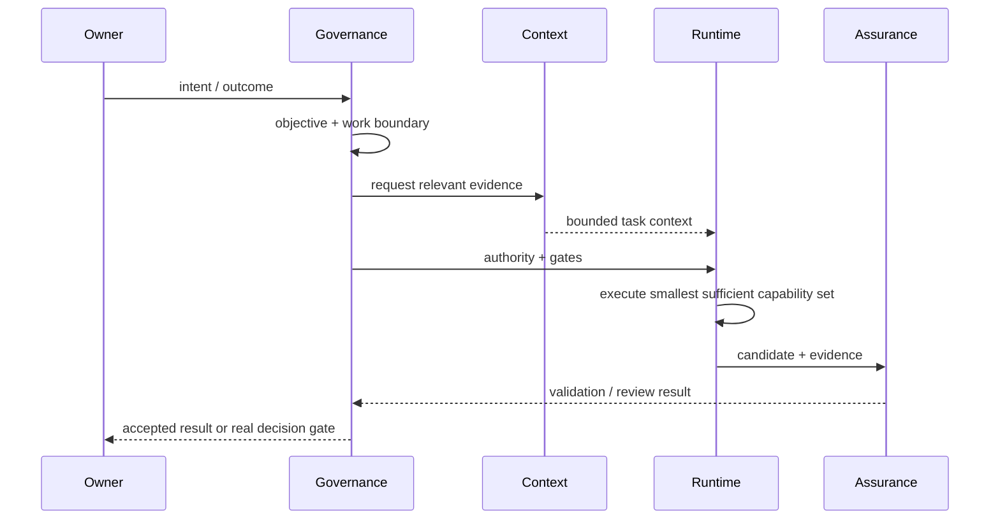

# Architecture

Sara v2 separates authority, context, execution, and assurance into four planes.

## Governance & Delivery
Owns what work is authorized and where it is in its lifecycle.

```text
Intent -> Objective -> Work Item -> State/Gates -> Change -> Result -> Reconciled completion
```

## Context & Cognition
Owns what evidence should be brought into the current reasoning task: repository discovery, task-conditioned evidence, uncertainty, memory boundaries, Experience/Outcome records, and learning candidates.

Context never creates authority.

## Runtime & Capability
Owns how authorized work is routed to the smallest sufficient capability set: Main Coordinator, specialist Agents, reusable Skills, and action/write boundaries.

It does not own project State or product intent.

## Evidence & Assurance
Owns proof: deterministic validation, independent review, exact candidate identity, acceptance evidence, rollback, recovery, and residual-risk reporting.

## Control flow



If two documents appear to own the same policy, the manifest and document registry decide.
